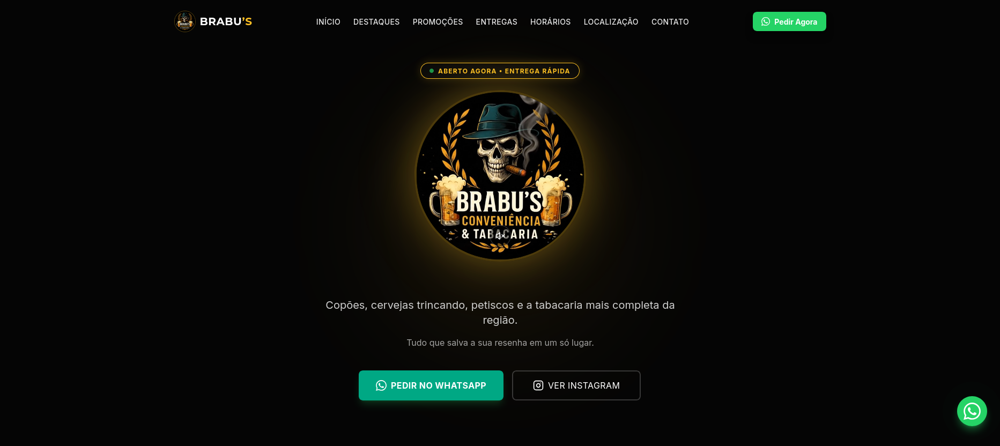

# 🍺 Brabu's Conveniência & Tabacaria

[](https://opensource.org/licenses/MIT)
[](https://vercel.com)

Premium landing page for **Brabu's Conveniência & Tabacaria** — a modern convenience store and tobacco shop in Aracoiaba, CE. Built with cutting-edge web technologies to deliver a fast, responsive, and stunning user experience.

[**🌐 Live Demo**](https://brabusconveniencia.vercel.app/)

---

## 📱 App Preview

<p align="center">
  
</p>

---

## ✨ Features

- 🎨 **Premium UI/UX**: Modern design with dark mode aesthetics, smooth animations, and micro-interactions
- 📱 **Fully Responsive**: Optimized for mobile, tablet, and desktop devices
- ⚡ **Lightning Fast**: Built with Vite for instant page loads and optimal performance
- 🎯 **SEO Optimized**: Proper meta tags, semantic HTML, and structured content
- 🔗 **Social Integration**: Direct WhatsApp ordering and Instagram integration
- 🗺️ **Interactive Map**: Dark-themed Google Maps with custom brand marker
- 🎨 **Brand Consistency**: Custom icons, colors, and typography aligned with brand identity
- ♿ **Accessible**: WCAG-compliant with proper ARIA labels and semantic HTML

---

## 🛠️ Tech Stack

- **Framework**: [React 19](https://react.dev/) with TypeScript
- **Build Tool**: [Vite 7](https://vitejs.dev/)
- **Styling**: [Tailwind CSS 3](https://tailwindcss.com/)
- **Icons**: [Lucide React](https://lucide.dev/)
- **Utilities**: clsx, tailwind-merge
- **Deployment**: [Vercel](https://vercel.com)

---

## 🚀 Getting Started

### Prerequisites

- **Node.js** (v18 or higher)
- **npm** or **yarn**

### Installation

1. Clone the repository:
   ```bash
   git clone https://github.com/melojrx/tachyon-omega.git
   cd tachyon-omega
   ```

2. Install dependencies:
   ```bash
   npm install
   ```

3. Start the development server:
   ```bash
   npm run dev
   ```

4. Open [http://localhost:5173](http://localhost:5173) in your browser.

---

## 📦 Build & Deploy

### Build for Production

```bash
npm run build
```

The optimized files will be in the `dist/` directory.

### Deploy to Vercel

1. Push your code to GitHub
2. Import the project in [Vercel](https://vercel.com)
3. Vercel will automatically detect the configuration and deploy

The `vercel.json` file ensures proper SPA routing and caching.

---

## 📁 Project Structure

```
tachyon-omega/
├── public/               # Static assets
│   └── favicon.svg       # Custom beer mug favicon
├── src/
│   ├── assets/          # Images and media
│   ├── components/      # React components
│   │   ├── layout/      # Header, Footer, etc.
│   │   ├── sections/    # Hero, Highlights, Contact, etc.
│   │   └── ui/          # Reusable UI components (Button, Card, etc.)
│   ├── config/          # Configuration files
│   │   └── site.ts      # Store info, hours, links
│   ├── lib/             # Utility functions
│   ├── App.tsx          # Main app component
│   ├── main.tsx         # Entry point
│   └── index.css        # Global styles & Tailwind
├── vercel.json          # Vercel deployment config
├── tailwind.config.js   # Tailwind configuration
└── package.json         # Project dependencies
```

---

## ⚙️ Configuration

All store information is centralized in `src/config/site.ts`:

- Store name, tagline, and address
- WhatsApp number and default message
- Instagram and Maps URLs
- Opening hours
- Highlights and features

Simply edit this file to update content without touching component code.

---

## 🎨 Key Components

### Hero Section
- Central logo with glow effect
- Animated badge ("Aberto Agora")
- Dual CTA buttons (WhatsApp + Instagram)

### Highlights
- Grid of 6 key features with icons
- Hover effects and animations

### Promo Banner
- Call-to-action for promotions
- WhatsApp integration

### Location
- Dark-themed interactive Google Maps
- Custom logo marker
- Store address and link to Google Maps

### Footer
- Brand info and social links
- Quick navigation
- Developer credits

---

## 🤝 Contributing

Contributions, issues, and feature requests are welcome!

---

## 📄 License

This project is licensed under the **MIT License**.

---

## 👨‍💻 Developer

**Júnior Melo**

- 📧 Email: [jrmeloafrf@gmail.com](mailto:jrmeloafrf@gmail.com)
- 🌐 Portfolio: [melojrx.github.io](https://melojrx.github.io/)
- 💼 GitHub: [@melojrx](https://github.com/melojrx)

---

Made with ❤️ and ☕ by [Júnior Melo](https://melojrx.github.io/) for **BRABU'S**
